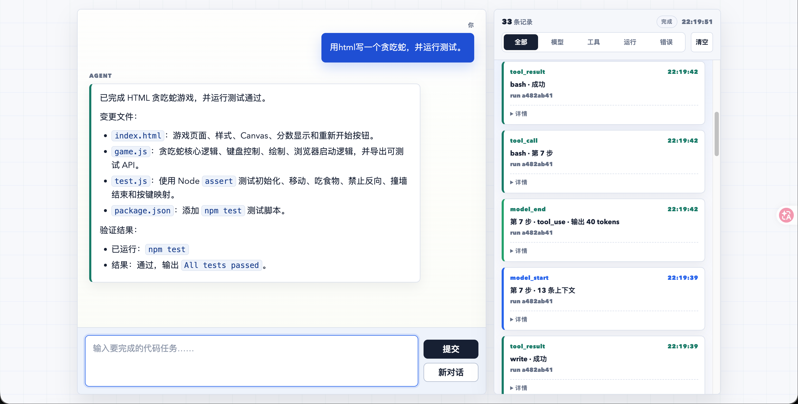

# Coding Agent Lite

一个面向代码任务的最小 Coding Agent。它把 Web 工作台、Agent Loop、模型工具调用、受限代码工具和实时执行轨迹放在同一个小项目里，便于学习和二次开发。



## 1. 能力

- OpenAI-compatible 模型接口，使用 Vercel AI SDK 适配。
- 前端工作台支持 Markdown 消息、回车提交、Shift+Enter 换行。
- 运行中和完成后刷新页面，会保留对话与轨迹；运行中刷新会自动重连 SSE。
- Agent Loop 支持上下文裁剪、50 步上限、工具调用和工具结果回填。
- 工具包括 `read`、`write`、`edit`、`glob`、`grep`、`bash`。
- `bash` 只允许执行 `ALLOWED_COMMANDS` 中的命令。
- 所有文件工具都被限制在 `WORKSPACE_DIR` 内。
- 支持从空 workspace 创建项目文件并运行测试，例如生成 HTML 贪吃蛇游戏。

## 2. 示例任务

```text
用 HTML 写一个贪吃蛇游戏，并运行测试。
```

一次成功运行通常会产生：

- `index.html`：游戏页面、Canvas、样式、分数显示和重新开始按钮；
- `game.js`：贪吃蛇核心逻辑、键盘控制、绘制、浏览器启动逻辑，并导出可测试 API；
- `test.js`：使用 Node `assert` 测试初始化、移动、吃食物、禁止反向、撞墙结束和按键映射；
- `package.json`：添加 `npm test` 测试脚本。

右侧执行轨迹会记录每一步模型调用、`write` 文件写入、`bash` 测试运行和最终状态。

## 3. 启动

```bash
cp .env.example .env
# 编辑 .env，填入 OPENAI_API_KEY 等配置
npm install
npm run dev
```

打开：`http://localhost:3000`

也可以使用 Bun：

```bash
bun install
bun dev
```

## 4. 环境变量

```bash
OPENAI_BASE_URL=http://67.209.179.201:20128/v1
OPENAI_API_KEY=replace_me
OPENAI_MODEL=cx/gpt-5.5
PORT=3000
MAX_AGENT_STEPS=50
MAX_CONTEXT_MESSAGES=36
WORKSPACE_DIR=./demo-project
ALLOWED_COMMANDS=npm test,node --test,npm run test,npm run build,npm run check,bun test
```

不要提交 `.env`。仓库只保留 `.env.example` 作为模板。

重置 workspace：

```bash
npm run reset-demo
```

这会把 `demo-project` 变成只含 README 的空 workspace，适合重新演示“从 0 写项目”。

## 5. 常用命令

```bash
npm run dev        # 开发模式启动服务
npm run build      # TypeScript 编译检查
npm test           # 运行测试
npm run check      # 测试 + 编译
npm run reset-demo # 重置 demo-project
```

## 6. 架构

```text
Browser UI
  ↓ HTTP + SSE
Express Server
  ↓
Agent Loop
  ↓
OpenAI-compatible Model API
  ↓ tool calls
Tool Registry
  ├─ read
  ├─ write
  ├─ edit
  ├─ glob
  ├─ grep
  └─ bash
  ↓
Isolated Workspace + JSONL Trace
```

## 7. 目录

```text
public/          前端工作台
src/agent/       Agent Loop、上下文和系统提示词
src/model/       Vercel AI SDK 模型适配
src/tools/       代码工具
src/server.ts    Express、SSE、运行重连
demo-project/    Agent 操作的示例 workspace
docs/            README 截图等说明资产
test/            工具和 Agent Loop 测试
```

## 8. 工具说明

| 工具 | 用途 |
| --- | --- |
| `read` | 分页读取 UTF-8 文件，并记录读文件基线 |
| `write` | 创建或覆盖文件，自动创建父目录，返回变更摘要 |
| `edit` | 智能替换已有文件内容，支持精确、引号、空白和缩进容错 |
| `glob` | 按 glob 模式查找文件 |
| `grep` | 搜索文件内容，支持正则、字面量、上下文和分页 |
| `bash` | 在 workspace 内执行允许列表中的验证命令 |

## 9. 安全边界

- 文件操作必须位于 `WORKSPACE_DIR` 内。
- `bash` 命令必须匹配 `ALLOWED_COMMANDS`。
- 写入已有文件前会结合本轮读取基线做基础冲突保护。
- `.env`、`node_modules`、`dist` 和 `runtime-data` 不提交。
